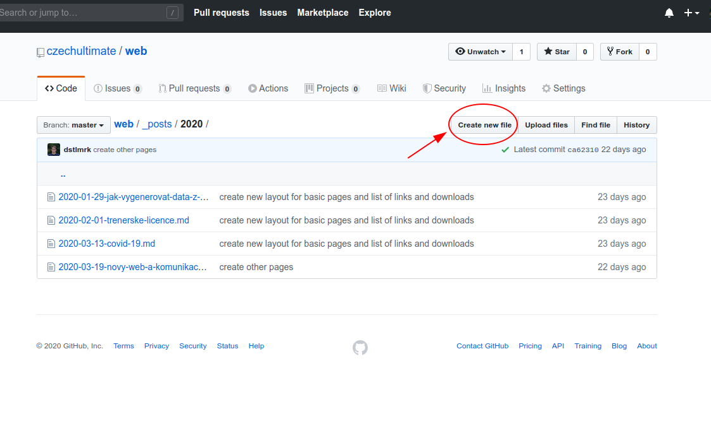
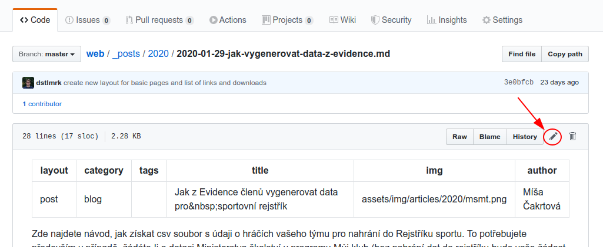
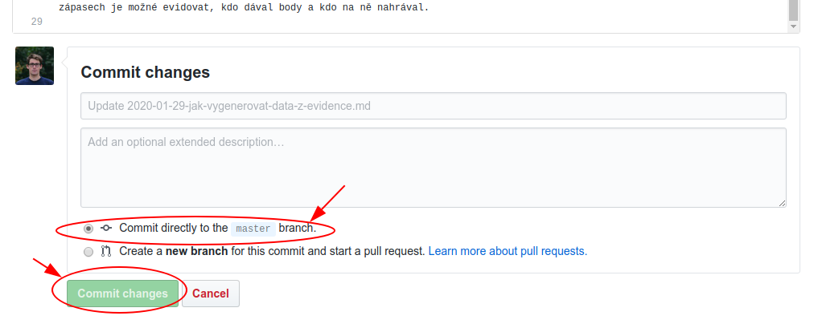

# Návod na práci s webem

Nejprve je nutné se zaregistrovat na https://github.com/ a požádát Máru o přístup do projektu https://github.com/czechultimate/web.

Je dobré vědět, že všechny změny jsou archivované. Takže pokud se něco nepovede, je vždycky cesta zpátky :)

Většina stránek je buď přímo v HTML nebo v [markdown](https://github.com/adam-p/markdown-here/wiki/Markdown-Cheatsheet) formátu (ten si můžete zkoušet [zde](https://stackedit.io)).

Kdo umí aspoň trochu s gitem, může si jednoduše repozitář stáhnout k sobě do počítače a tam soubory upravovat trochu jednodušeji než tady na webu. Na Windows, Mac i Linux existuje dostatek tůlů pro práci s gitem.

## Obecně

### Jak tvořit obsah

- **Předem předpokládám, že budete psát bez pravopisných a stylistických chyb! I sebelepší web/design/foto to pak už nezachrání.**
- Nadpisy článků pište zajímavě. Tak aby uživatel měl důvod kliknout a číst dál. Saša dával na školení s médii příklad, že když proběhne valná hromada, tak nemáte psát titulek typu "Proběhla valná hromada 2020", ale spíš vypíchnout nějakou zajímavou informaci. Například "Končí dlouholetý předseda".
- Když to není nutné, nepiště do titulků rok. Stačí přece datum zveřejnění článku, aby každý pochopil kontext.

### Jak vytvořit nový soubor



### Jak editovat již existující soubor



### Jak potvrdit změny

**POZOR!** Pro aktivaci změn je nutné pod editací kliknout na tlačítko **Commit changes** a mít zaškrtnutou první možnost. Změny na webu se pak projeví maximálně do několika minut.



### Kam nahrávat obrázky/soubory

Všechny obrázky ke článkům se nahrávají do `assets/img/posts/year`. Ve složce `assets/img/posts/uzitecne` jsou obrázky, které se můžou občas hodit k nekterým článkům, pokud nebudeme mít k dispozici lepší foto. Dokumenty se nahrávají do `assets/files`.

**Nahrávejte obrázky s minimální šířkou 550px!**

### Jak odkazovat na jiné stránky webu

Vždycky můžete použít celou adresu, kterou zkopírujete z prohlížeče, ale lepší je použít pouze část adresy. Link pak bude fungovat i když web změní doménu nebo se různě bude v budoucnu měnit.

Takhle NE:
```
[Jak začít hrát](https://czechultimate.github.io/web/jak-zacit)
```

Takhle ANO:
```
[Jak začít hrát](jak-zacit)
```

Linky mimo web samozřejmě musíte uvádět celé, včetně https na začátku.

## Prakticky

### Jak přidat článek

Ve složce `_posts/2020` (analogicky pro jiný rok)  najdete všechny články. Stačí vytvořit nový soubor ve formátu `YYYY-MM-DD-volitelny-popisek.md`. Datum na začátku názvu určuje, kdy se článek na webu zveřejní. Můžete si tak nachystat text na budoucí publikaci. Nezapomeňte, že obsah se píše pomocí markdownu. 

Na začátku souboru se musí objevit speciální struktura, která nastavuje některá metadata článku. Například kategorii nebo tagy. Povinný je layout (vždy `post`) a title. Doporučuju uvést autora a vložit cestu k úvodnímu obrázku (obrázky k článkům nahrávejte do `assests/img/posts/rok`).

```yml

---
layout: post
category: rozvoj
tags: ucitele, skoleni
title: Vzdělávání trenérů v roce 2020
img: assets/img/post/2020/repre_team.jpg
author: Jan Novák
---

Obsah článku...
```


### Jak upravit konkrétní stránku na webu

Většina stránek je ve složce `_includes/content`. Všechny stránky se editují v markdownu.

### Jak přidat soubor ke stažení, odkaz nebo kontakt na stránku

V souboru `_data/documents.yml` najdete strukturu, který mapuje cesty k souborům. První část se věnuje dokumentům na zvláštní stránce. Druhá část zobrazuje soubory na jednotlivých stránkách.

Do kolonky `link` můžete uvést odkaz nebo cestu k souboru.

Odkazy a kontakty se podobně vkládají sem: `_data/links.yml`, resp. `_data/contacts.yml`.

### Jak přidat/editovat seznam oddílů

K tomu slouží soubor `_data/oddily.yml`. Web přidávejte bez http a www, pouze doménu. Facebook naopak pouze cestu za prvním lomítkem. Např. pro `https://www.facebook.com/chlupatazaba` uložíte pouze `chlupatazaba`. Příklad:

```yml
web: frisbee.cz/chlupata-zaba
fb: chlupatazaba
```

# Development

Docs:
- https://jekyllrb.com/docs/
- https://learn.cloudcannon.com/jekyll-cheat-sheet/

## Prerequisites

Install docker and docker-compose.

## How to run

Run `docker-compose up` and open `localhost:4000` in your favourite web browser.

## How to build

Only if you need that. It's not necessary to run it.

```
docker run --rm -it --volume="$PWD:/srv/jekyll" --env JEKYLL_ENV=production jekyll/jekyll jekyll build
```

## How to add dependency

Update Gemfile and run `docker-compose down && docker-compose up`.

## Semantic UI

### How to install

```bash
# install nodejs and gulp
npm install semantic-ui --save
cd semantic/
gulp build
```

### How to update

```bash
npm update
```
